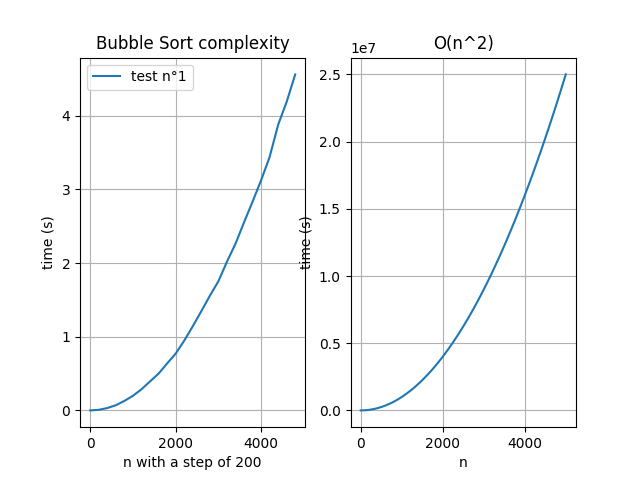

# Complexity-assignment-2020

University assignment about computational complexity theory

## How to set up the environnement

  **REQUIREMENTS**
  
  -python3  
  -pip3  
  -numpy  
  -matplotlib  
  -python3-tk (for gui plot viewing)
  
  1. **installing the requirements**
    pip install -r requirements.txt
  
  
